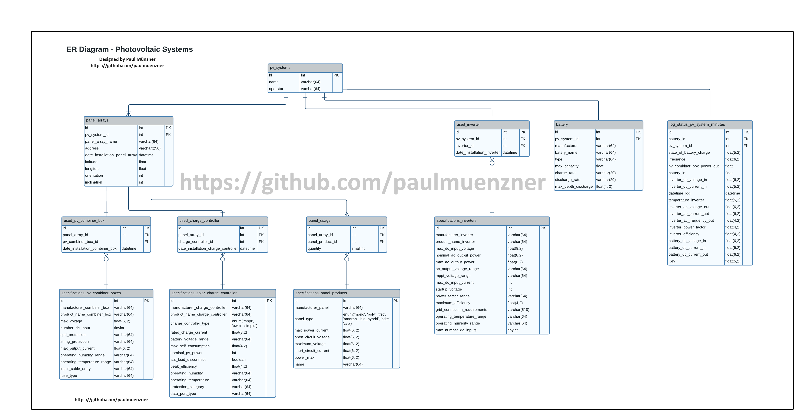

<!-- PROJECT SHIELDS -->
<!--
*** https://www.markdownguide.org/basic-syntax/#reference-style-links
-->

[![Issues][issues-shield]][issues-url]

[![GNU License][license-shield]][license-url]
<!--  -->
[![paulmuenzner github][github-shield]][github-url] 
[![Contributors][contributors-shield]][contributors-url]
 <!-- [![paulmuenzner.com][website-shield]][website-url] -->

<!-- PROJECT LOGO -->
 

  

  <h3 align="center">MySQL Database Photovoltaic Systems</h3>

  

    Listing - Administration - Logging
     
    <a href="#about-the-project"><strong>EXPLORE DOCS</strong></a>
     
     
    <a href="https://github.com/paulmuenzner/sql-database-photovoltaic-systems/issues">Request Feature</a>
    ·
    <a href="https://github.com/paulmuenzner/sql-database-photovoltaic-systems/issues">Report Bug</a>
  

<!-- TABLE OF CONTENTS -->

  
Table of Contents

  <ol>
    <li><a href="#about-the-project">About The Project</a></li>
    <li><a href="#purposes">Purposes</a></li>
    <li><a href="#representation">Representation</a></li>
    <li><a href="#limitations">Limitations</a></li>
    <li><a href="#indexes">Indexes</a></li>
    <li><a href="#roadmap">Roadmap</a></li>
    <li><a href="#contributing">Contributing</a></li>
    <li><a href="#license">License</a></li>
    <li><a href="#contact">Contact</a></li>
  </ol>

<!-- ABOUT THE PROJECT -->
## About The Project

This MySQL database for photovoltaic (PV) grid systems serves as an organized repository of crucial information related to each system's components, their relationships, historical data, and real-time operational parameters. It plays a pivotal role in monitoring, managing, and optimizing the performance of the PV system, enabling efficient decision-making and ensuring the system operates at its full potential. Additionally, it provides an overview of the main components used including their technical characteristics and details.

The database contains essential relations that model the structure and connections among the various components of each PV system. For instance, it maintains tables representing detailed parameters and technical information of the panel arrays, PV combiner boxes, charge controllers, inverters, and batteries. These tables hold details about each component, such as date of installation, product name and manufacturer, plenty of device-specific technical characteristics.

In addition to static information, the database allows to logs real-time values that provide critical insights into the system's operation. This includes data on state of battery charge, irradiance levels, voltage and current input and output of the inverter. Real-time monitoring of these parameters allows for immediate assessment of system performance, detection of potential issues, and timely interventions to optimize efficiency and maximize energy production.

Click to enlarge

The database's role extends beyond real-time monitoring to historical data storage. It keeps records of past performance and system events. Analyzing historical data can uncover patterns, trends, and irregularities in system behavior, facilitating predictive maintenance, performance forecasting, and identifying areas for improvement. Moreover, the database facilitates reporting and analysis, generating meaningful insights through queries, reports, and data visualization. This aids stakeholders in understanding the PV system's overall performance, optimizing battery usage, and planning for system expansions or upgrades.

In summary, this database acts as a centralized hub, housing plenty critical information pertaining to the system's components, relationships, real-time data, and historical records. Its purpose is to ensure efficient management, enhance system performance, and contribute to the sustainable and effective utilization of solar energy.

The database can hold all the afore-mentioned information for any number of photovoltaic systems independent from each other.

It should be noted, however, that this design does not claim to be complete. It does, however, provide an understanding of key components and the operation of PV systems that feed energy into the grid or store it temporarily in batteries. Possible other components, such as a vault rapid shutdown, surge protection devices, energy meter or residual current circuit breakers, have been omitted for the sake of clarity. Please be aware that this database is not fully ready for immediate implementation, as the requirements of each system can vary. Consider it as a foundational resource and guide, offering a starting point and orientation tailored to meet your specific needs.

## Purposes

A user interacting with a database for a photovoltaic (PV) system can retrieve detailed technical parameter of implemented components and should be able to perform various tasks and actions that are essential for monitoring, managing, and optimizing the performance of the PV system. 

Here are several overarching, essential functionalities that users should be able to accomplish, each designed to serve specific purposes, use cases, and achieve valuable outcomes::

1. **Monitor Real-Time Data:**
   - View real-time values of key parameters such as irradiance, battery charge state, power input/output, and more.
   - Monitor the system's performance and energy production in real-time.

2. **Access Historical Data:**
   - Retrieve historical performance data to analyze trends, identify patterns, and make informed decisions based on past system behavior.

3. **Analyze System Performance:**
   - Conduct performance analysis to identify inefficiencies, optimize energy production, and improve overall system performance.

4. **Generate Reports:**
   - Generate customized reports summarizing system performance, energy production, and other relevant metrics over specific time periods.

5. **Plan and Optimize Battery Usage:**
   - Analyze battery charge/discharge patterns and plan optimal usage to maximize battery life and ensure reliable energy storage.

6. **Manage Components and Specifications:**
   - Access and update information about system components and technical specifications useful for installation details and maintenance requirements.

7. **Plan for Upgrades and Expansions:**
   - Evaluate the database to plan system upgrades, expansions, or integration of new components by analyzing existing data and performance trends.

9. **Integrate with Other Systems:**
    - Integrate data from the PV system database with other enterprise systems, such as financial databases or energy grid management systems, to facilitate seamless operation and data exchange.

10. **Set Alerts and Notifications:**
    - Configure alerts and notifications based on predefined thresholds or conditions to receive timely updates on system performance or anomalies.

<!-- Representation -->
## Representation

This SQL database encompasses information about various devices within a photovoltaic system:
-   Each independent photovoltaic system is represented by a distinct entry in the 'pv_systems' table.
-   Multiple solar panel arrays can be associated with a single photovoltaic system, and each solar panel array is exclusively linked to a specific photovoltaic system.
-   Each photovoltaic system is equipped with a battery of variable size, serving the purpose of storing or extracting energy.
-   The 'log_status_pv_system_minutes' table acts as a data logger, storing critical, time-dependent, and dynamically changing measured values at minute intervals.
-   Product listing tables, such as those for solar panel products, PV combiner boxes, solar charge controllers, and inverters, facilitate the definition of all installed components for each panel array. This allows for the generation of an equipment overview sorted by panel array and PV system.

Click to enlarge

### Relationships

As per the entity-relationship diagram, the database is represented through the following tables:

1. **pv_systems:**
   - Positioned at the top of the ER diagram and directly linked to panel arrays, the battery table, and real-time measured values in log_status_pv_system_minutes.

2. **panel_arrays:**
   - Contains one or more panels, ideally of the same type, with specifications and technical details listed in specifications_panel_products and linked via panel_usage.

3. **battery:**
   - Holds technical details related to batteries.

4. **log_status_pv_system_minutes:**
   - Stores real-time log data, including state of battery charge, inverter power input and output, battery power flow, electric energy distribution from the PV combiner box, and irradiance levels.

5. **used_pv_combiner_box:**
   - Links used combiner boxes to each panel array.

6. **panel_usage:**
   - Links installed solar panel types to each panel array.

7. **used_charge_controller:**
   - Links panel arrays with their respective charge controllers.

8. **used_inverter:**
   - Links implemented inverters to each PV system.

9. **specifications_pv_combiner_boxes:**
   - Lists characteristic technical data related to combiner boxes.

10. **specifications_panel_products:**
    - Lists characteristic technical data related to solar panels.

11. **specifications_solar_charge_controller:**
    - Lists characteristic technical data related to charge controllers.

12. **specifications_inverters:**
    - Lists characteristic technical data related to inverters.

Linking is realized with primary keys in each table and foreign additional keys where needed and useful.

More details on attributes of each table can be found in the entity relationship diagram or the script itself. Listing all and each attribute would go beyond the scope of this article and not yield any additional information.

## Limitations
The database for the photovoltaic (PV) system focuses on storing and managing information related to system components, real-time data, historical performance, and operational parameters. However, it does not handle aspects beyond this scope, such as:

1. **External Weather Data:**
Weather data such as wind, precipitation, or outdoor temperature, which may influence system performance, is typically sourced from external weather services rather than stored within this database.

2. **Financial Transactions:**
Details regarding financial transactions, billing, payments, or financial accounts related to the PV system are managed in a separate financial database or system not covered here.

3. **Environmental Policies and Regulations:**
Information regarding environmental policies, regulations, compliance, or legal matters related to the PV system and its location is outside the database's focus.

4. **Geographical Data:**
Geographic information like maps, topography, or geographic analysis are managed by specialized geographic information systems (GIS) and sparsely covered in this database by only noting the pv system's address with one set of longitude. Details are beyond the scope of this database.

5. **User Authentication and Access Control:**
User authentication, access control policies, and user account management fall under a separate authentication and access control system not covered here.

6. **Energy Grid Integration:**
Integration and communication with the broader energy grid, including synchronization, demand-response mechanisms, and grid management, are handled through specialized grid integration systems. Also information about the transmission grid or local grid are not covered in this database.

7. **Manufacturing and Supply Chain Information:**
Detailed data about the procurement, or vendor management for PV system components are typically managed in dedicated enterprise resource planning (ERP) systems. Also information on maintenance management, any kind of support tickets or task and contract management are not covered here.

8. **Scope of technical devices:**
This design does not claim to be complete. It does, however, provide an understanding of key components and the operation of PV systems that feed energy into the grid or store it temporarily in batteries. Possible other components, such as a vault rapid shutdown, surge protection devices, energy meter or residual current circuit breakers, have been omitted for the sake of clarity. This would go beyond the scope of this final project set by Harvard University and get lost in too much technical detail. This final project is about SQL databases - not electrical engineering.

In summary, the database's scope is limited to the PV system's technical and operational aspects, excluding broader contextual data or functionalities handled by other specialized systems.

## Indexes

The following list outlines key indexes created within the database, enhancing the efficiency of data retrieval and optimizing query performance.

1. **log_status_pv_system_minutes__pv_system_id**
   - *Table:* log_status_pv_system_minutes
   - *Columns:* pv_system_id

2. **used_inverter__pv_system_id**
   - *Table:* used_inverter
   - *Columns:* pv_system_id

3. **used_inverter__inverter_id**
   - *Table:* used_inverter
   - *Columns:* inverter_id

4. **used_charge_controller__panel_array_id**
   - *Table:* used_charge_controller
   - *Columns:* panel_array_id

5. **used_charge_controller__charge_controller_id**
   - *Table:* used_charge_controller
   - *Columns:* charge_controller_id

6. **battery__pv_system_id**
   - *Table:* battery
   - *Columns:* pv_system_id

7. **panel_usage__panel_array_id**
   - *Table:* panel_usage
   - *Columns:* panel_array_id

8. **panel_usage__panel_product_id**
   - *Table:* panel_usage
   - *Columns:* panel_product_id

9. **panel_arrays__pv_system_id**
   - *Table:* panel_arrays
   - *Columns:* pv_system_id

10. **used_pv_combiner_box__panel_array_id**
    - *Table:* used_pv_combiner_box
    - *Columns:* panel_array_id

11. **used_pv_combiner_box__pv_combiner_box_id**
    - *Table:* used_pv_combiner_box
    - *Columns:* pv_combiner_box_id

These indexes play a crucial role in speeding up data retrieval processes, particularly for queries involving the specified columns.

<!-- ROADMAP -->
## Roadmap

-   ⬜️ Add sample data for all tables
-   ⬜️ Inccrease number of entries for new and existing sample data scripts

<!-- CONTRIBUTING -->
## Contributing

Contributions are what make the open source community such an amazing place to learn, inspire, and create. Any contributions you make are **greatly appreciated**.

Contributions are more than welcome! See [CONTRIBUTING.md](CONTRIBUTING.md) for
more info.

(<a href="#readme-top">back to top</a>)

<!-- LICENSE -->
## License

Distributed under the GNU General Public License v2.0. See [LICENSE](LICENSE.txt) for more information.

(<a href="#readme-top">back to top</a>)

<!-- CONTACT -->
## Contact

Paul Münzner: [https://paulmuenzner.com](https://paulmuenzner.com) 

Project Link: [https://github.com/paulmuenzner/sql-database-photovoltaic-systems](https://github.com/paulmuenzner/sql-database-photovoltaic-systems)

(<a href="#readme-top">back to top</a>)

<!-- MARKDOWN LINKS & IMAGES -->
<!-- https://www.markdownguide.org/basic-syntax/#reference-style-links -->
[license-shield]: https://img.shields.io/badge/license-GPL_2.0-orange.svg?colorB=FF5733
[license-url]: https://github.com/paulmuenzner/sql-database-photovoltaic-systems/blob/master/LICENSE.txt
[issues-shield]: https://img.shields.io/github/issues/paulmuenzner/sql-database-photovoltaic-systems.svg
[issues-url]: https://github.com/paulmuenzner/sql-database-photovoltaic-systems/issues
[github-shield]: https://img.shields.io/badge/paulmuenzner-black.svg?logo=github&logoColor=ffffff&colorB=000000
[github-url]: https://github.com/paulmuenzner
[contributors-shield]: https://img.shields.io/github/contributors/paulmuenzner/sql-database-photovoltaic-systems.svg
[contributors-url]: https://github.com/paulmuenzner/sql-database-photovoltaic-systems/graphs/contributors